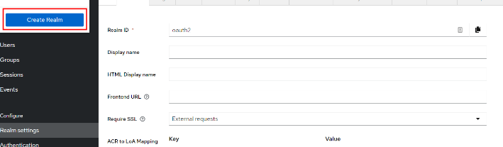
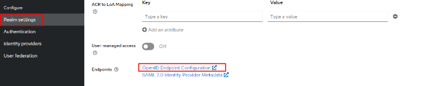
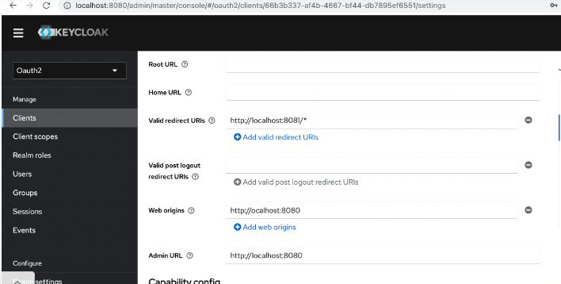

# keycloak 설치 및 세팅
> keycloak docker-compose 세팅 과정 기록

#### 출처 : https://github.com/keycloak/keycloak-containers/blob/main/docker-compose-examples/keycloak-postgres.yml
```yaml
version: '3'

volumes:
  postgres_data:
      driver: local

services:
  postgres:
      image: postgres
      volumes:
        - postgres_data:/var/lib/postgresql/data
      environment:
        POSTGRES_DB: keycloak
        POSTGRES_USER: keycloak
        POSTGRES_PASSWORD: password
  keycloak:
      image: quay.io/keycloak/keycloak:legacy
      environment:
        DB_VENDOR: POSTGRES
        DB_ADDR: postgres
        DB_DATABASE: keycloak
        DB_USER: keycloak
        DB_SCHEMA: public
        DB_PASSWORD: password
        KEYCLOAK_USER: admin
        KEYCLOAK_PASSWORD: Pa55w0rd
        # Uncomment the line below if you want to specify JDBC parameters. The parameter below is just an example, and it shouldn't be used in production without knowledge. It is highly recommended that you read the PostgreSQL JDBC driver documentation in order to use it.
        #JDBC_PARAMS: "ssl=true"
      ports:
        - 8080:8080
      depends_on:
        - postgres
```
## 최초 설정
1. Realm 생성
> 
2. endpoint list
> 
### redirect_uri 해결법


## 추가 작업 
### 작업 후 ssl로 접근 불가시 추가 작업이 필요
1. postgres 5432 포트 export
2. keycloak 계정 접속환경 세팅
3. realm > ssl_required 컬럼 NONE 세팅


